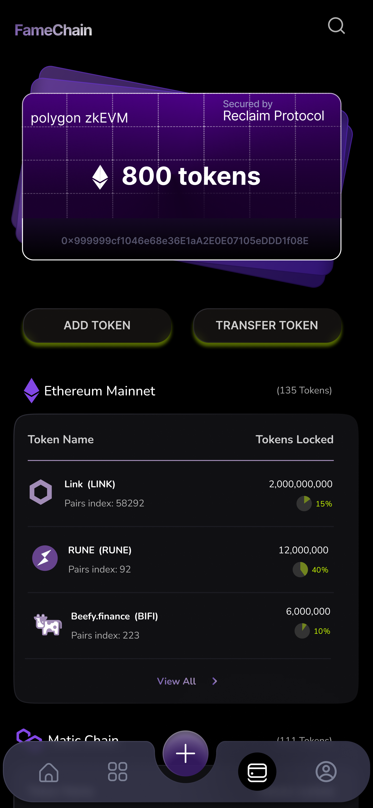
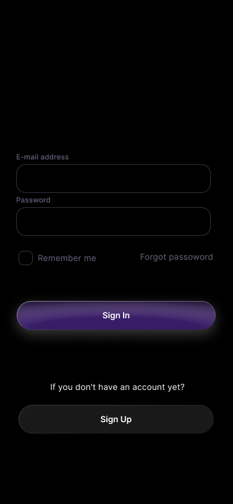
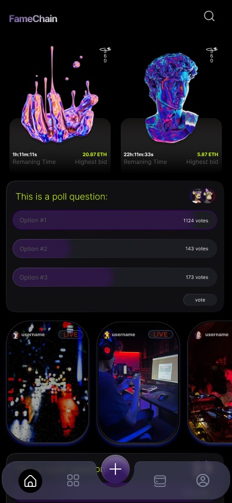
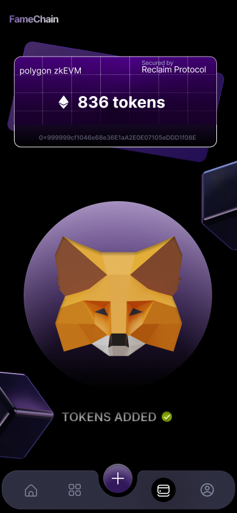
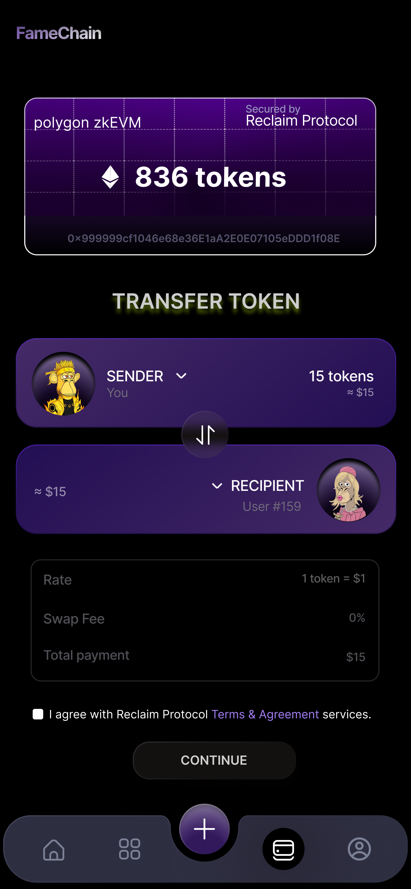
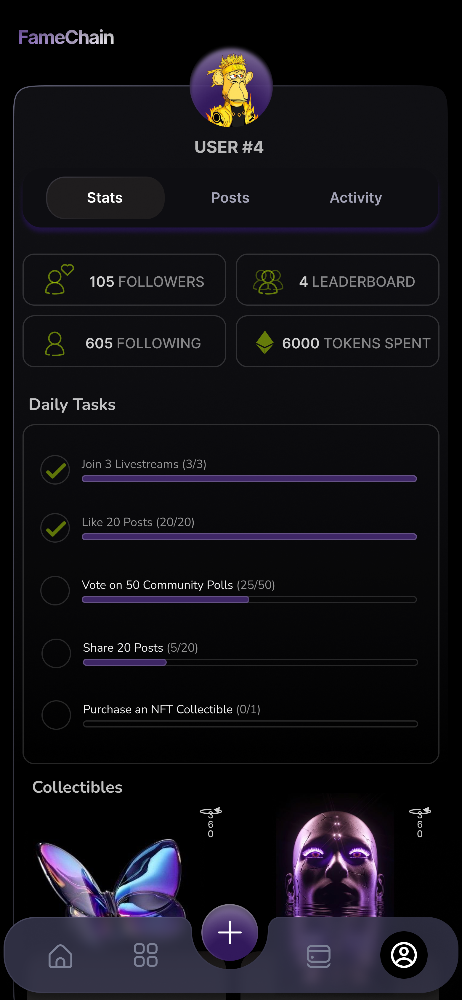
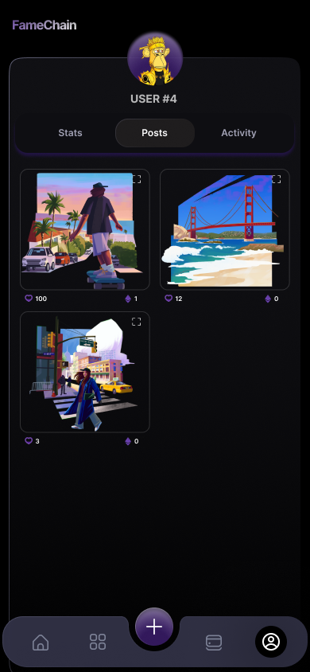
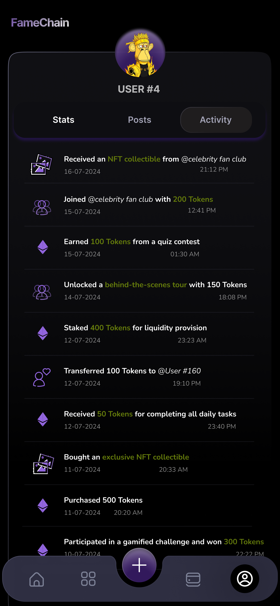

# Fame Chain App Walkthrough

**Fame Chain** is a decentralized social media platform that connects celebrities with their fans through secure and engaging interactions. By solving the problems of impersonal and insecure traditional social media platforms, Fame Chain provides a solution that prioritizes real-time engagement and privacy.

## 1. Opening Screens
When users first interact with Fame Chain, they are greeted with an intuitive and visually engaging opening screen. This section introduces users to the app and highlights its core features.

## 2. Introduction Screens
The introduction screens give users an overview of Fame Chain’s key features. These include the ability to interact with celebrities through livestreams, participate in polls, and engage with non-fungible tokens (NFTs). The intro aims to capture the essence of Fame Chain’s core vision of fostering direct and meaningful engagement between fans and celebrities.

        

## 3. Login and Signup Process
The login and signup process is streamlined for security. Users can sign up or log in using cryptocurrency wallets such as **MetaMask**, **Trust Wallet**, or by entering their **Ethereum address**. Fame Chain leverages the **Polygon zkEVM** network to ensure fast, secure, and confidential transactions, providing a smooth and safe experience for the user.

        

    

## 4. Home Page
The **Home Page** is the central hub for user engagement. Here, users can view polls, NFTs from followed celebrities, and access livestreams. Livestreaming is one of Fame Chain’s key features, allowing fans to directly interact with their favorite creators. Fans can **donate tokens** during live sessions, fostering meaningful interactions and generating new revenue streams for celebrities.

## 5. 'For You' Page
The **'For You' Page** is designed to help users discover trending content, top creators, and the most engaged fans. It highlights the most active users who have donated tokens, participated in livestreams, or supported creators in other ways. This section is dynamic and keeps the community engaged with the most relevant content.

    

## 6. Wallet Management
The **Wallet** section allows users to manage their tokens and cryptocurrencies. Users can view their total tokens, including **Ethereum mainnet tokens** and **MATIC tokens**. The wallet page also allows users to add or transfer tokens.

### Key features include:

- **Add Token**: Users can convert currency (ETH) into tokens via this button.  
      
- **Transfer Token**: Allows users to transfer tokens to other users or creators, providing a seamless transaction experience.  
  

Fame Chain uses **Polygon zkEVM** to offer lower transaction fees, making the process more efficient and affordable for users.

## 7. Profile Page
The **Profile Page** allows users to track and manage their Fame Chain activities. It is divided into three main sections:

- **Stats**: Tracks important statistics such as the number of followers, leaderboard rank, and total tokens spent.  
- **Daily Tasks and Collectibles**: This section incentivizes engagement by listing daily tasks such as participating in polls, joining livestreams, and liking posts. Completing all tasks rewards users with tokens. Users can also view their exclusive digital collectibles.
  

- **Posts and Activity**: Displays all posts and logs every interaction, transaction, and engagement on Fame Chain. This includes a detailed record of token purchases, gifts during livestreams, task rewards, NFT acquisitions, and token transfers.  
       

## 8. Final Thoughts
Fame Chain is built on the **Polygon zkEVM** platform, ensuring secure, low-cost, and efficient transactions for all users. By empowering fans and creators with token-based engagement, Fame Chain transforms the way celebrities and fans interact. With features like livestreaming, NFTs, and community-driven activities, Fame Chain is pioneering the future of social media engagement.
